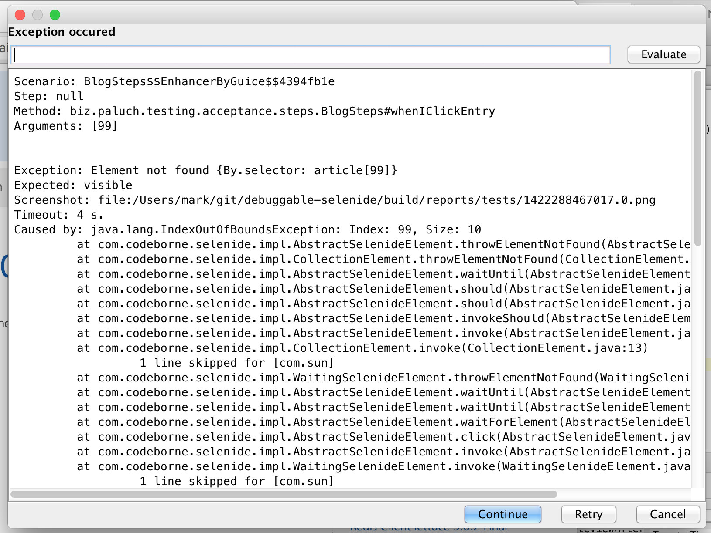
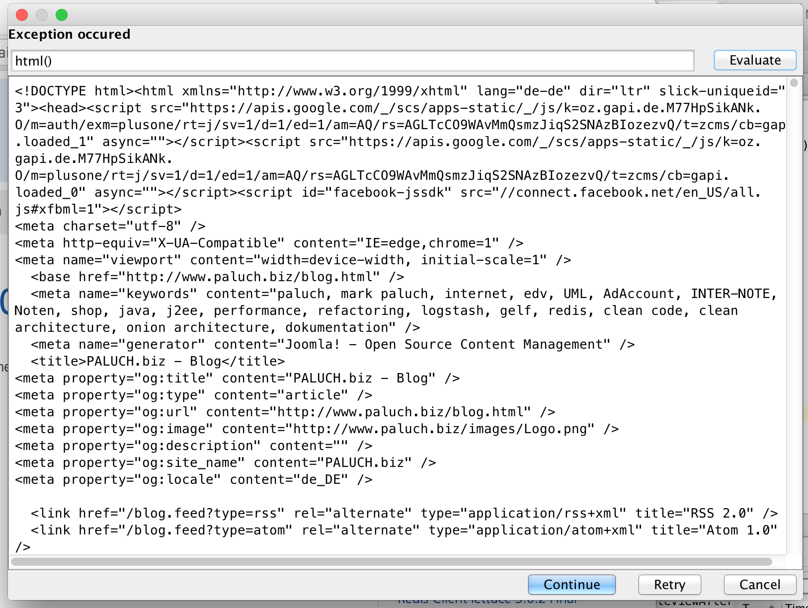
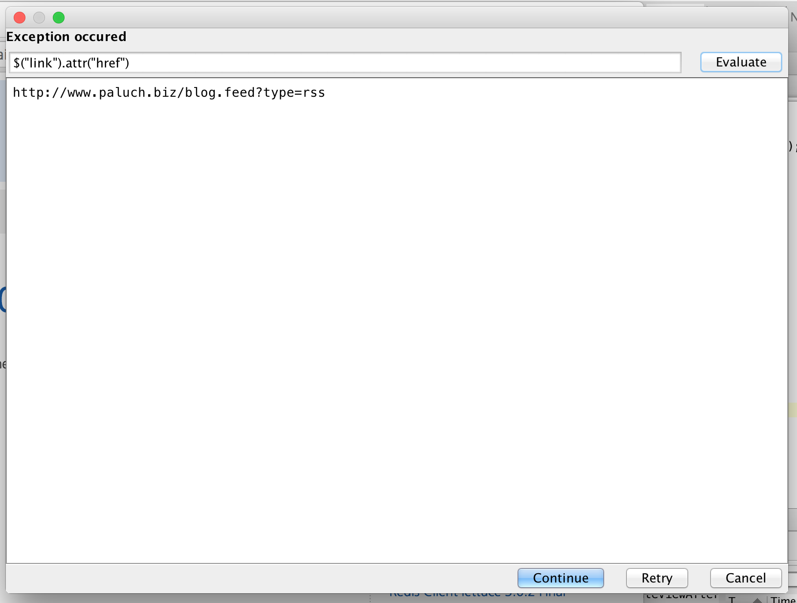

# Debuggable Acceptance Tests with JBehave, Selenide, and Guice

This package contains a base for debuggable Selenide acceptance tests. But what means debuggable?

When Java/Scala Selenium tests fail, they just stop somewhere. Browser closes, and that's it. You don't have a chance to interact at that moment. You can take a screenshot and save the HTML for later analysis, which might help. But this is
still too low level for effective debugging.

I created this sample project from prior project experiences and provide an example base for acceptance tests based
on [JBehave](http://jbehave.org), Selenide and Google Guice.

The tests just click a bit around on my website; the test coverage is quite small. There is one case running through smoothly and another
case that fails. In this case, a Swing windows comes up and prompts you what to do.

## How is this project different?

You can interact when `AsertionError`'s occur. You can retry the action (nice, when doing Ajax), continue (skip the error) or cancel the whole test run. You do not need to guess where to set a breakpoint in your test suite.
As soon as exceptions occur, you'll be prompted how to proceed.

You can retrieve the HTML page source as it is seen by the browser. 

And you can inspect particular elements using Selenide's JQuery syntax (`$("selector")` or `$("selector")`).

The code is evaluated using Java's JavaScript engine. Available functions are:

 * `$(...)` and methods/functions of Selenide's `$` result (e. g. `$(a").val()`)
 * `$$(...)` and methods/functions of Selenide's `$$` (e. g. `$("a").size()`)
 * `html()`
 * WebDriver methods/functions exposed by `wd` variable (e. g. `wd.getPageSource()`)

The result is displayed `toString`'ed.

## Components

This project uses multiple components for its operations.

* Configuration
* JBehave
* Selenide
* Selenium
* Google Guice

### Configuration

All configuration values are stored in `src/main/resources/services.properties`. The Config file uses property substitution and
properties can be overridden by System Properties (they have to be defined in `services.properties` first).

### JBehave

[JBehave](http://jbehave.org) is a framework for Behaviour-Driven Development. JBehave needs story files and Java implementations
to know, what to invoke. See `src/test/stories/paluch.biz.blog.story` and `src/test/java/biz/paluch/testing/acceptance/steps/BlogSteps.java`
for examples.

The included/excluded stories can be controlled by directory/file patterns like `*/**.stories`. See `biz.paluch.testing.acceptance.AcceptanceProperties` for
property names. Included classes for dependency injection (scanner) are configured in `biz.paluch.testing.acceptance.SeleniumJBehaveStories`.

### Selenide
[Selenide](http://selenide.org) is a wrapper around [Selenium](http://docs.seleniumhq.org/projects/webdriver/) with many advantages.
It simplifies the way how to deal with Selenium providing a JQuery-like API and improved AJAX support.

### Google Guice

[Guice](https://github.com/google/guice) provides dependency injection and the interceptor mechanism for `@DebugableInvocation`.

## Running

The easiest way to run the project is using Maven.

`$ mvn clean install exec:java -Dexec.mainClass=biz.paluch.testing.acceptance.StandaloneLauncher`

Since this way is also used for batch execution (on your Continuous Integration server), it does not utilize any debug interaction.
Else this would harm your build process.

If you want to run the project with debug interaction, you have two choices:

1. Import it into IntelliJ IDEA (sorry, Eclipse and NetBeans do not work since the GUI part is IDEA-specific)
2. Execute it using Maven command line.

### Running with IntelliJ IDEA
Import it into IntelliJ IDEA, build and start the class `biz.paluch.testing.acceptance.StandaloneLauncher` as JUnit test.

### Running with Maven

Issue

`$ mvn clean install exec:java -Dexec.mainClass=biz.paluch.testing.acceptance.StandaloneLauncher`

on the command line.

It is very likely, that you want to specify a different browser. Support for `chrome`, `firefox` and `ie` is built in 
and the appropriate drivers are contained within this project (see `driver` directory). The launcher should pick up the 
right versions for you and set the system properties for Selenium.

Using **Google Chrome**

`$ mvn clean install exec:java -Dexec.mainClass=biz.paluch.testing.acceptance.StandaloneLauncher -Dselenium.browser=chrome`

Using **Microsoft Internet Explorer**

`$ mvn clean install exec:java -Dexec.mainClass=biz.paluch.testing.acceptance.StandaloneLauncher -Dselenium.browser=ie`

Using **Mozilla Firefox**

`$ mvn clean install exec:java -Dexec.mainClass=biz.paluch.testing.acceptance.StandaloneLauncher -Dselenium.browser=firefox`

### Running with an IDE other than IntelliJ IDEA

The GUI part was created with IDEA's GUI designer. During build time the Maven plugin `ideauidesigner-maven-plugin` compiles
the GUI XML into Java code. Other IDE's do not support the way IDEA's style and would overwrite the compiled GUI code. 
You can still run the project, but you have to build the project using maven first, and then you need to add the production 
code JAR `target/debuggable-selenide-1.0-SNAPSHOT.jar` as first library within your run configuration.

License
-------
* [The MIT License (MIT)] (http://opensource.org/licenses/MIT)
